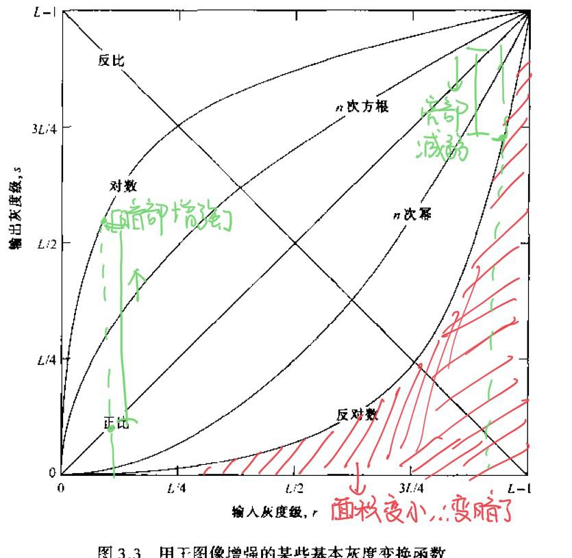
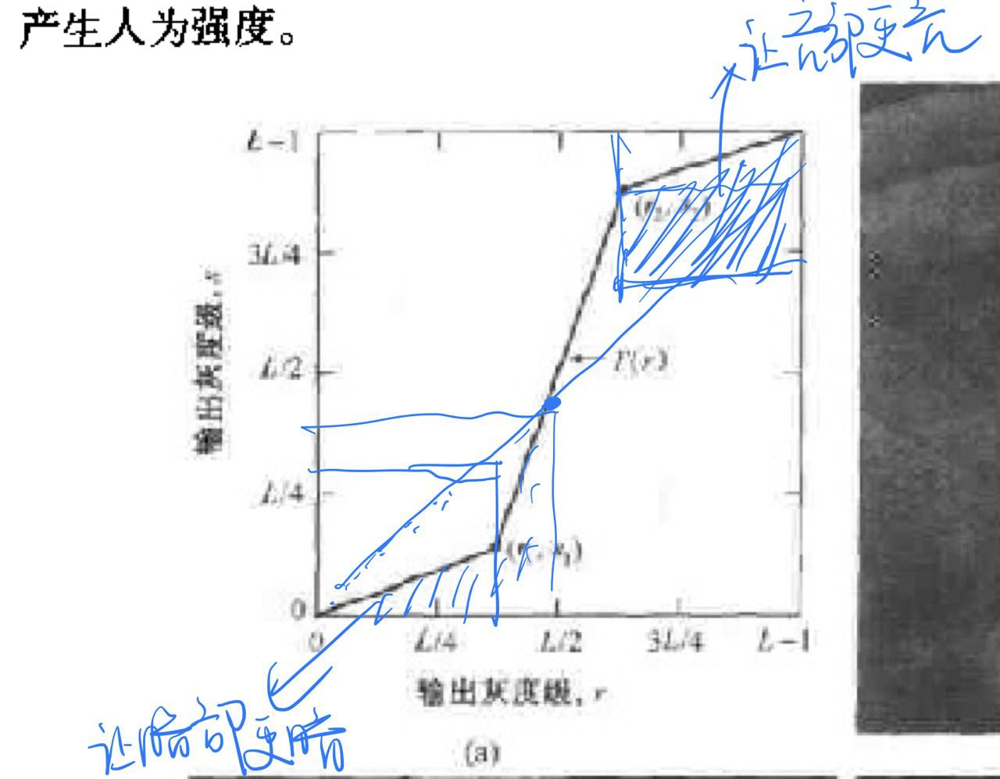
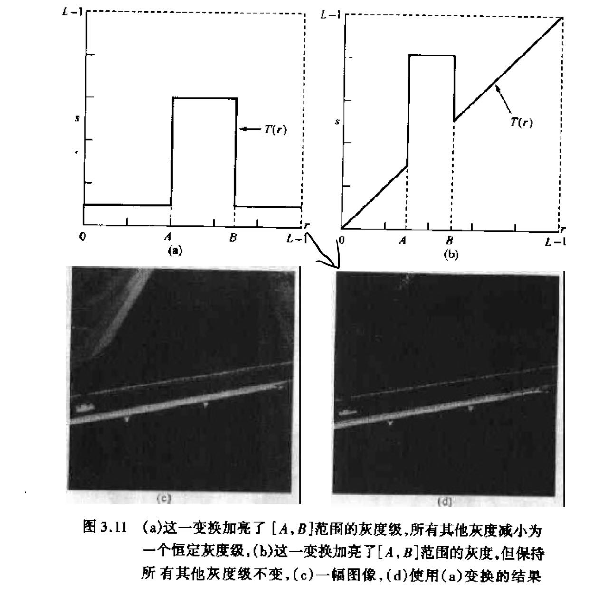

# 第 3，4 章：图像增强

> 图像增强分为空间域与频域
>
> - 空间域增强：对像素点进行处理
> - 频域：修改图像的傅氏变换为基础

## 空间域图像增强

### 基本灰度变换

- [图像反转](inverse.py)
- [幂律变换](pow.py)
- [对数变换](log.py)
- 分段线性变换
  - 对比拉伸
    
  - 灰度切割：提高特定灰度范围的亮度
    
  - 位图切割：什么位平面的，不重要，过

### 直方图处理
> 直方图离散函数:$h(r_k) = n_k$ 
> * $r_k$表示在k级灰度
> * $n_k$表示k级灰度的像素个数
