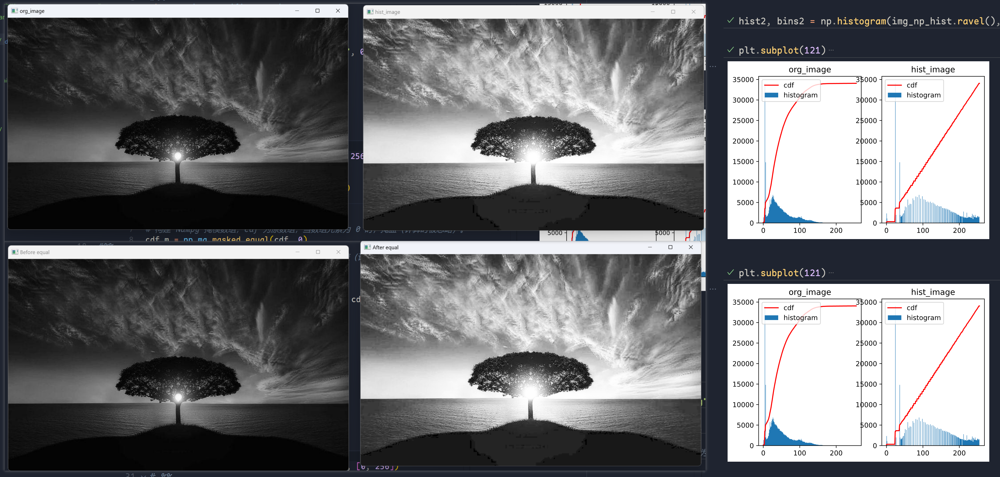

# 第 3，4 章：图像增强

> 图像增强分为空间域与频域
>
> - 空间域增强：对像素点进行处理
> - 频域：修改图像的傅氏变换为基础

## 空间域图像增强

### 基本灰度变换

- [图像反转](inverse.py)
- [幂律变换](pow.py)
- [对数变换](log.py)
- 分段线性变换
  - 对比拉伸
    
  - 灰度切割：提高特定灰度范围的亮度
    
  - 位图切割：什么位平面的，不重要，过

### 直方图处理
> 直方图离散函数:$h(r_k) = n_k$ 
> * $r_k$表示在k级灰度
> * $n_k$表示k级灰度的像素个数

* [直方图均衡化](hist_equalize.py):用于对比度增强，可以将较暗，较亮的图片搞得正常; 通俗的讲就是把原来挤在一起的灰度均匀的摊开了
  
  *  图左侧为原图，右上为opencv自带函数
  *  右下为numpy实现算法
  *  最右侧为原图的cdf和直方图以及numpy实现后的cdf与直方图

* 直方图匹配：用给定的直方图来进行灰度的重新分布

## 空间滤波基础
> 滤波器：操作的像素及其领域所构成的窗口/核/模板

### 平滑处理
> 用于模糊处理和减小噪声
* [平滑线性滤波器](mean_filter.py):也叫均值滤波，存在边缘模糊的负面效果(擅长处理椒盐噪声)
* [统计排序滤波器](median_filter.py):非线性的，最常见的取排序中50%的值，也叫中值滤波(擅长处理椒盐噪声)；也可以取100%(最大值滤波器), 0%(最小值滤波器)